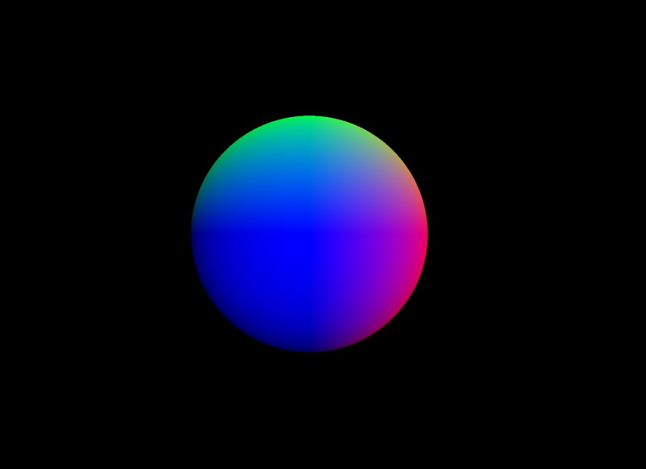
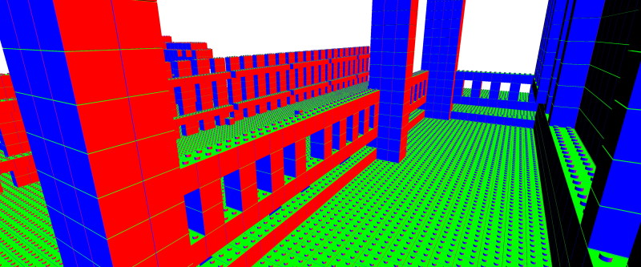
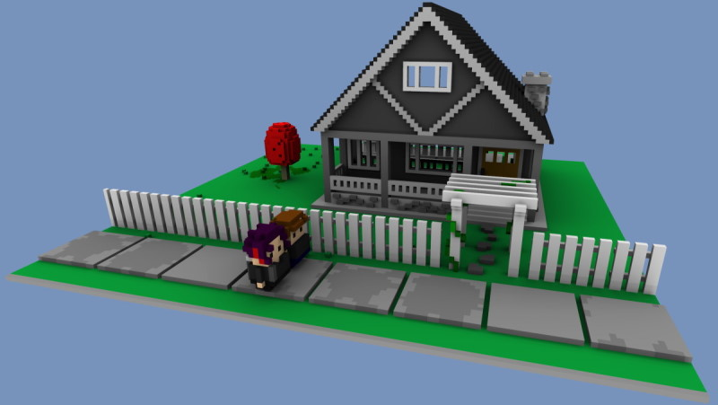
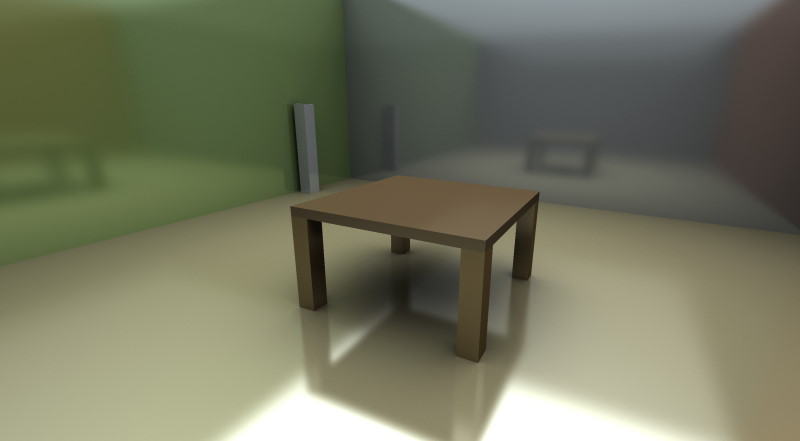
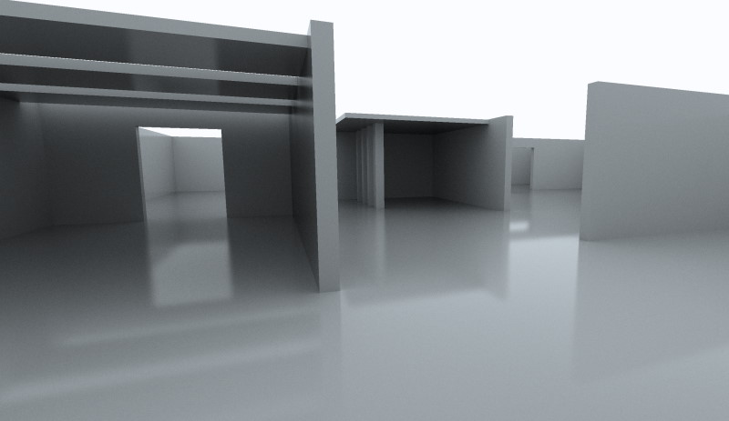
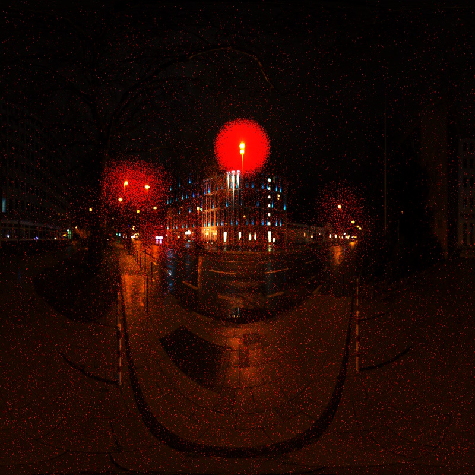

# lwjgl3-demos
Demo suite for LWJGL 3

## Example Images

[vulkan/raytracing/SimpleSphere.java](./src/org/lwjgl/demo/vulkan/raytracing/SimpleSphere.java)

[vulkan/raytracing/SdfBricks.java](./src/org/lwjgl/demo/vulkan/raytracing/SdfBricks.java)

[opengl/raytracing/VoxelLightmapping2.java](./src/org/lwjgl/demo/opengl/raytracing/VoxelLightmapping2.java)

[opengl/raytracing/tutorial/Tutorial3.java](./src/org/lwjgl/demo/opengl/raytracing/tutorial/Tutorial3.java)

[opengl/raytracing/tutorial/Tutorial8_2.java](./src/org/lwjgl/demo/opengl/raytracing/tutorial/Tutorial8_2.java)

[opengl/sampling/HierarchicalSampleWarping.java](./src/org/lwjgl/demo/opengl/sampling/HierarchicalSampleWarping.java)

## Building

    ./mvnw package
    
To override main class

    ./mvnw package -Dclass=opengl.UniformArrayDemo

## Running

    java -jar target/lwjgl3-demos.jar

on Mac OS you need to specify the `-XstartOnFirstThread` JVM argument, so the above becomes:

    java -XstartOnFirstThread -jar target/lwjgl3-demos.jar

To override main class

    java -cp target/lwjgl3-demos.jar org.lwjgl.demo.opengl.UniformArrayDemo
